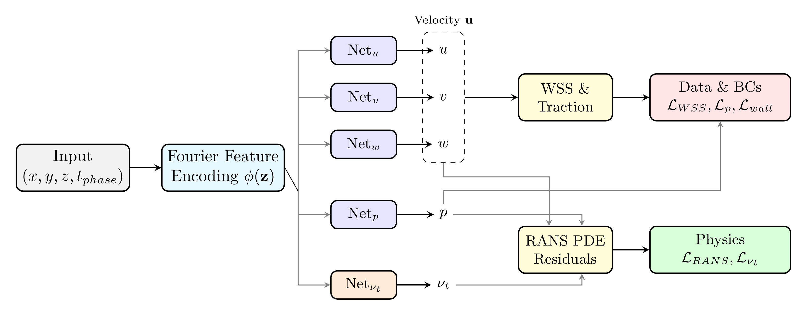
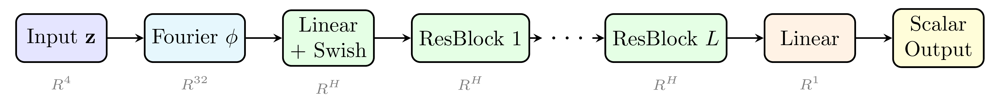

# Physics-Informed Neural Networks for Hemodynamic Prediction in Thoracic Aortic Aneurysms

> **A RANS-Constrained Sparse Data Approach**

This repository contains the source code accompanying the paper:

> *Physics-Informed Neural Networks for Hemodynamic Prediction in Thoracic Aortic Aneurysms: A RANS-Constrained Sparse Data Approach*

## Abstract

We present a physics-informed neural network (PINN) framework for predicting hemodynamic fields in thoracic aortic aneurysms (TAAs). The model learns from sparse CFD wall data — using approximately one-third of available measurements — whilst enforcing Reynolds-averaged Navier–Stokes (RANS) equations with a learnable turbulent viscosity field. The framework incorporates non-Newtonian Carreau–Yasuda blood rheology, pulsatile inlet conditions, and a gradient-norm adaptive loss weighting scheme that dynamically balances data-driven and physics-based objectives. An alternating dual-optimiser strategy ensures the turbulent viscosity network receives dedicated gradient signal from the governing equations. Evaluated across six anatomically distinct aneurysm configurations spanning two diameters and three morphologies, the framework achieves a mean WSS Pearson correlation of 0.929 and mean absolute error of 0.174 Pa.

## Repository Structure

```
TAA-aneurysm/
├── data/                       # CFD simulation data (CSV files)
├── src/
│   ├── data/loader.py          # Data loading and non-dimensionalisation
│   ├── models/
│   │   ├── networks.py         # Network architecture (Fourier + residual MLP)
│   │   ├── blocks.py           # Residual blocks, Swish activation
│   │   └── fourier.py          # Fourier feature encoding
│   ├── losses/
│   │   ├── wss.py              # WSS loss computation
│   │   ├── physics.py          # RANS residual loss
│   │   └── boundary.py         # No-slip and pressure boundary losses
│   ├── training/trainer.py     # Training loop with adaptive loss weighting
│   └── utils/
│       ├── geometry.py         # Wall normals, collocation point sampling
│       └── plotting.py         # Visualisation utilities
├── experiments/                # Training outputs (metrics, figures)
├── train.py                    # Entry point
└── requirements.txt            # Python dependencies
```

## Setup

```bash
git clone https://github.com/michaelajao/TAA-aneurysm.git
cd TAA-aneurysm

conda create -n taa_pinn python=3.10 -y
conda activate taa_pinn
pip install -r requirements.txt
```

**Requirements:** PyTorch ≥ 2.0, Open3D ≥ 0.17, NumPy, Pandas, Matplotlib, SciPy, PyYAML. A CUDA-capable GPU is recommended.

## Dataset

### CFD Simulations

6 aneurysm geometries × 2 cardiac phases = 12 configurations. Simulations were performed using the SST *k*–*ω* transition model with Carreau–Yasuda non-Newtonian rheology.

### Geometries

| Code | CSV Name | Diameter | β (*r*/*R*) | Morphology |
|------|----------|----------|-------------|------------|
| AS5 | 5 cm Standard | 5.0 cm | 1.00 | Axisymmetric (Fusiform) |
| AS6 | 6 cm Standard | 6.0 cm | 1.00 | Axisymmetric (Fusiform) |
| AD5 | 5 cm ASD | 5.0 cm | 0.56 | Anterior-Dominant (Saccular) |
| AD6 | 6 cm ASD | 6.0 cm | 0.62 | Anterior-Dominant (Saccular) |
| PD5 | 5 cm ASU | 5.0 cm | 1.78 | Posterior-Dominant (Saccular) |
| PD6 | 6 cm ASU | 6.0 cm | 1.61 | Posterior-Dominant (Saccular) |

*β* = 1.0: axisymmetric; *β* > 1.0: posterior bulge; *β* < 1.0: anterior bulge.

### Cardiac Phases

| Phase | *t*_phase | Description |
|-------|-----------|-------------|
| Systolic | 0.0 | Peak pressure/flow phase |
| Diastolic | 1.0 | Low pressure/flow phase |

Each CSV contains wall surface coordinates (*X*, *Y*, *Z*), pressure, and WSS vector components from CFD.

## Governing Equations

The PINN enforces the incompressible RANS equations with non-Newtonian rheology:

- **Continuity:** ∇·**u** = 0
- **Momentum:** ρ(**u**·∇**u**) = −∇*p* + ∇·**τ**_eff
- **Effective stress:** **τ**_eff = μ_eff(∇**u** + (∇**u**)ᵀ), where μ_eff = μ(γ̇) + ρν_t
- **WSS:** **τ**_wall = **τ**_eff·**n** − [(**τ**_eff·**n**)·**n**]**n**

### Carreau–Yasuda Non-Newtonian Viscosity

Blood viscosity is modelled as shear-rate dependent:

| Parameter | Symbol | Value |
|-----------|--------|-------|
| Zero-shear viscosity | μ₀ | 0.16 Pa·s |
| Infinite-shear viscosity | μ∞ | 0.0035 Pa·s |
| Time constant | λ | 8.2 s |
| Power-law index | *n* | 0.2128 |
| Yasuda exponent | *a* | 0.64 |

### Non-Dimensionalisation

All quantities are scaled for numerical stability:

| Scale | Definition |
|-------|-----------|
| *L*_ref | Inlet diameter (0.028 m) |
| *U*_ref | √(*P*_ref / ρ) |
| *P*_ref | max\|pressure\| from CFD |
| τ_ref | μ∞ · *U*_ref / *L*_ref |
| Re | ρ · *U*_ref · *L*_ref / μ∞ |

## PINN Loss Function

The total loss combines physics constraints with data matching:

$$\mathcal{L}_{\text{total}} = \lambda_{\text{pde}} \mathcal{L}_{\text{pde}} + \lambda_{\text{bc}} \mathcal{L}_{\text{bc}} + \lambda_{\text{pressure}} \mathcal{L}_{\text{pressure}} + \lambda_{\text{wss}} \mathcal{L}_{\text{wss}}$$

| Loss Term | What It Measures | Computed At |
|-----------|-----------------|-------------|
| $\mathcal{L}_{\text{pde}}$ | RANS momentum and continuity residuals | Interior collocation points |
| $\mathcal{L}_{\text{bc}}$ | No-slip condition: ‖**u**‖² = 0 | Wall boundary points |
| $\mathcal{L}_{\text{pressure}}$ | Pressure error: ‖*p*_pred − *p*_CFD‖² | Wall boundary points |
| $\mathcal{L}_{\text{wss}}$ | WSS error: ‖**τ**_pred − **τ**_CFD‖² | Wall boundary points |

Loss weights are dynamically balanced using gradient-norm adaptive weighting (Wang et al., 2021), which equalises the gradient magnitudes across all loss terms with exponential moving average smoothing.

## Network Architecture

Five independent scalar-valued networks share a common input **z** = (*x*, *y*, *z*, *t*_phase) and Fourier feature encoding. Four flow branches predict velocity components and pressure; a fifth branch predicts the learnable turbulent viscosity *ν*_t.

### High-Level Architecture

<p align="center">
  
</p>

A shared input **z** is mapped through Fourier feature encoding and fed into five independent networks. The velocity outputs (*u*, *v*, *w*) are used to derive WSS via automatic differentiation of the stress tensor at wall points — WSS is not a separate network output. Data and boundary losses operate on wall predictions; the physics loss enforces RANS residuals at interior collocation points using all five outputs.

### Single Branch Architecture

<p align="center">
  
</p>

Each residual block: **h**^(ℓ+1) = **h**^(ℓ) + **W**₂ σ(**W**₁ **h**^(ℓ)), where σ is Swish activation. No activation after the skip addition preserves gradient flow.

### Branch Specifications

| Branch | Hidden Dim (*H*) | Residual Blocks (*L*) | Output Transform | Parameters |
|--------|------------------|-----------------------|------------------|------------|
| Net_u, Net_v, Net_w, Net_p | 128 | 6 | Identity | ~205,000 each |
| Net_νt | 64 | 4 | softplus(*x* + 2) + *ν*_t,min | ~37,000 |

**Total model size:** ~857,000 trainable parameters across all five networks.

- **Fourier encoding:** 16 frequencies (*K*), scale σ = 1.0, producing 2*K* = 32 features via sin/cos projections with a fixed random matrix **B** ∈ ℝ^(4×16)
- **Activation:** Swish (x · sigmoid(x)) — infinitely differentiable, required for computing PDE residuals and WSS via automatic differentiation
- **Weight initialisation:** Kaiming normal; biases initialised to zero
- **νt positivity:** Enforced via softplus with shift ζ = 2.0 and hard floor *ν*_t,min = 0.001

## Configuration

Training is driven by YAML configuration files. Create a `configs/` directory with one file per geometry. Example (`configs/AS5_config.yaml`):

```yaml
data:
  geometry: AS5
  phases: [systolic, diastolic]
  data_dir: data/
  files:
    systolic: "5cm systolic.csv"
    diastolic: "5cm diastolic.csv"
  subsample_factor: 3
  normalization:
    length_scale: 0.05

model:
  architecture: fourier_residual
  input_dim: 4
  hidden_dim: 128
  num_layers: 6
  use_fourier: true
  num_frequencies: 16
  fourier_scale: 1.0
  device: cuda
  nut:
    hidden_dim: 64
    num_layers: 4
    lr_multiplier: 10.0
    reg_weight: 100.0
    reg_target: 0.05
    nu_t_min: 0.001

training:
  batch_size: 4096
  wall_batch_size: 16000
  epochs: 10000
  learning_rate: 0.0001
  scheduler:
    type: CosineAnnealingLR
    eta_min: 1.0e-6
  gradient_clip: 1.0
  output_dir: experiments/AS5/

loss_weights:
  lambda_physics: 0.01
  lambda_BC_noslip: 10.0
  lambda_WSS: 1.0
  lambda_pressure: 10.0
  lambda_inlet: 10.0
  lambda_outlet: 10.0

inlet_outlet:
  enabled: true
  n_radial: 6
  n_angular: 12
  inlet_velocity:
    systolic: 0.5
    diastolic: 0.1

adaptive_weights:
  enabled: true
  update_interval: 100
  alpha: 0.9
  ref_loss: wss

physics:
  mu: 0.0035
  rho: 1060.0
  n_interior_points: 6000
  non_newtonian:
    enabled: true
    model: carreau_yasuda
    mu_inf: 0.0035
    mu_0: 0.16
    lambda: 8.2
    n: 0.2128
    a: 0.64
```

Adjust `data.geometry`, `data.files`, and `training.output_dir` for each geometry. See the data file mapping:

| Geometry | Systolic File | Diastolic File |
|----------|---------------|----------------|
| AS5 | `5cm systolic.csv` | `5cm diastolic.csv` |
| AS6 | `6cm systolic.csv` | `6cm diastolic.csv` |
| AD5 | `5cm ASD systolic.csv` | `5cm ASD Diastolic.csv` |
| AD6 | `6cm ASD Systolic.csv` | `6cm ASD diastolic.csv` |
| PD5 | `5cm ASU systolic.csv` | `5cm ASU Diastolic.csv` |
| PD6 | `6cm ASU systolic.csv` | `6cm ASU Diastolic.csv` |

## Usage

```bash
# Train a single geometry
python train.py --config configs/AS5_config.yaml

# Resume from a checkpoint
python train.py --config configs/AS5_config.yaml --resume experiments/AS5/best_model.pt

# Select a specific GPU
CUDA_VISIBLE_DEVICES=0 python train.py --config configs/AS5_config.yaml
```

## Citation

```bibtex
@article{taa_pinn2026,
  title   = {Physics-Informed Neural Networks for Hemodynamic Prediction in
             Thoracic Aortic Aneurysms: A RANS-Constrained Sparse Data Approach},
  author  = {[Authors]},
  journal = {[Journal]},
  year    = {2026},
  note    = {Manuscript in preparation}
}
```

## References

- Raissi, M., Perdikaris, P., & Karniadakis, G. E. (2019). Physics-informed neural networks: A deep learning framework for solving forward and inverse problems involving nonlinear partial differential equations. *Journal of Computational Physics*, 378, 686–707.
- Wang, S., Teng, Y., & Perdikaris, P. (2021). Understanding and mitigating gradient flow pathologies in physics-informed neural networks. *SIAM Journal on Scientific Computing*, 43(5), A3055–A3081.
- Arzani, A., Wang, J.-X., & D'Souza, R. M. (2021). Uncovering near-wall blood flow from sparse data with physics-informed neural networks. *Physics of Fluids*, 33(7), 071905.
- Ur Rehman, H., et al. (2025). Physics-informed neural networks for fluid–structure interaction analysis of pulsatile flow in arterial aneurysms associated with Marfan syndrome. *Computer Methods in Applied Mechanics and Engineering*.
- Tancik, M., et al. (2020). Fourier features let networks learn high frequency functions in low dimensional domains. *NeurIPS 2020*.
