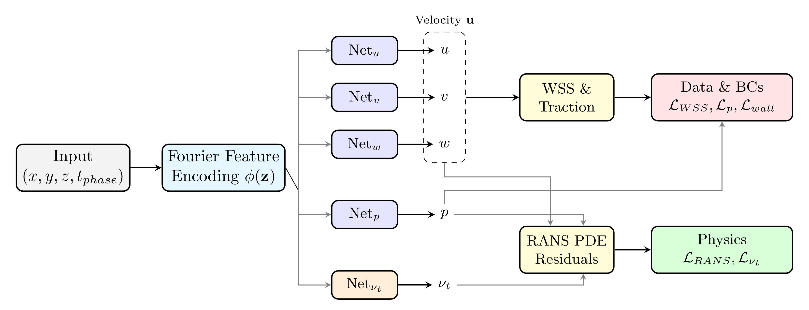
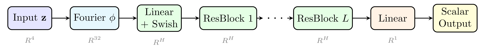

# Multiphysics FSI Modeling and a PINN Surrogate for Thoracoabdominal Aneurysms

Source code for the physics-informed neural network (PINN) surrogate presented in:

> M. Abaid Ur Rehman, Helmi Temimi, Michael Ajao-Olarinoye, Aymen Laadhari,
> Mohamed Kamel Riahi and Imad Kissami.
> *Multiphysics Fluid–Structure Interaction Modeling and Physics-Informed Neural Network
> Surrogate for Morphology-Dependent Stress Localization in Thoracoabdominal Aneurysms.*
> Manuscript under review.

## Overview

The study performs two-way coupled fluid–structure interaction (FSI) simulations on six
idealised thoracoabdominal aneurysm models — axisymmetric fusiform and posterior- or
anterior-dominant saccular geometries at 5 cm and 6 cm diameters — under pulsatile inflow,
Carreau–Yasuda shear-thinning rheology and an SST *k*–*ω* transition turbulence model, and
complements them with a PINN surrogate that learns from sparse CFD wall data while enforcing
the Reynolds-averaged Navier–Stokes (RANS) equations with a learnable turbulent viscosity field.

**What this repository contains: the PINN surrogate.**

| | |
|---|---|
| **In this repository** | The PINN implementation ([src/](src/)), the 12 CFD wall-export CSVs used to train it ([data/](data/)), per-geometry configs ([configs/](configs/)), and the training and post-processing entry points. |
| **Not in this repository** | The FSI/CFD simulations themselves. Those were run in **ANSYS Fluent** coupled to **Static Structural** through the System Coupling interface. The ANSYS case files are not versioned here; `data/` holds their exported wall surfaces. |

**Scope of the surrogate.** The PINN is a *per-geometry, rigid-wall flow* model. It predicts
velocity (*u*, *v*, *w*) and pressure *p* only, and derives wall shear stress (WSS) by automatic
differentiation of the predicted velocity field at the wall — WSS is not a network output.
Structural quantities (wall deformation, von Mises stress) and every rupture-risk conclusion in
the paper come from the FSI analysis alone. A separate network is trained for each of the six
geometries, so cross-geometry transfer is outside the scope of this formulation.

## Setup

```bash
git clone https://github.com/michaelajao/TAA-aneurysm.git
cd TAA-aneurysm

conda create -n taa_pinn python=3.10 -y
conda activate taa_pinn
pip install -r requirements.txt
```

**Dependencies** ([requirements.txt](requirements.txt)): PyTorch ≥ 2.0, NumPy ≥ 1.24,
Pandas ≥ 2.0, Matplotlib ≥ 3.7, PyYAML ≥ 6.0, tqdm ≥ 4.65, Open3D ≥ 0.17 (wall-normal
estimation), Plotly ≥ 5.15 and Kaleido ≥ 0.2 (3D figure export), ConflictFree ≥ 0.1
(the optional ConFIG optimiser strategy). A CUDA-capable GPU is strongly recommended —
training one geometry takes roughly 3.5–6.5 h on an NVIDIA Quadro RTX 8000.

## Repository layout

```
TAA-aneurysm/
├── train.py                  # training entry point
├── requirements.txt
├── configs/                  # one YAML per geometry (AS5, AD5, PD5, AS6, AD6, PD6)
├── data/                     # 12 ANSYS CFD-Post wall exports (6 geometries × 2 phases)
├── figures/                  # architecture diagrams used in this README
├── scripts/
│   └── run_training.sh       # launch all six geometries sequentially on one GPU
└── src/
    ├── data/loader.py        # CSV parsing, non-dimensionalisation, standardisation
    ├── models/               # networks.py, blocks.py (residual + Swish), fourier.py
    ├── losses/               # physics.py (RANS residual), wss.py, boundary.py
    ├── training/trainer.py   # TAATrainer: dual-optimiser loop, adaptive weighting
    └── utils/                # geometry.py (normals, collocation), plotting.py (figures/metrics)
```

`experiments/` and `logs/` are created at runtime and are gitignored.

## Dataset

Six aneurysm geometries × two cardiac phases = 12 CFD wall exports. Snapshots were taken at
peak systole (*t* = 0.109 s) and end diastole (*t* = 0.359 s) of the converged FSI solution,
where d*Q*/d*t* ≈ 0 so each snapshot can be treated as quasi-steady.

### Geometries

*r* is the posterior bulge dimension and *R* the anterior one; β = *r*/*R*.

| Code | Diameter | *r* (cm) | *R* (cm) | β | Morphology | Wall points / phase |
|------|----------|----------|----------|------|------------|---------------------|
| AS5 | 5.0 cm | 2.5 | 2.5 | 1.00 | Axisymmetric (fusiform) | 70,843 |
| PD5 | 5.0 cm | 3.2 | 1.8 | 1.78 | Posterior-dominant (saccular) | 53,959 |
| AD5 | 5.0 cm | 1.8 | 3.2 | 0.56 | Anterior-dominant (saccular) | 54,129 |
| AS6 | 6.0 cm | 3.0 | 3.0 | 1.00 | Axisymmetric (fusiform) | 73,963 |
| PD6 | 6.0 cm | 3.7 | 2.3 | 1.61 | Posterior-dominant (saccular) | 73,966 |
| AD6 | 6.0 cm | 2.3 | 3.7 | 0.62 | Anterior-dominant (saccular) | 73,933 |

β = 1.0 axisymmetric; β > 1.0 posterior bulge; β < 1.0 anterior bulge. All models use a
2 cm inlet/outlet diameter representing the non-aneurysmal descending aorta.

Wall data are subsampled by a factor of three (`data.subsample_factor: 3`), so roughly
one third of the 400,793 wall points per phase — 133,601 — are used for training.

Each CSV concatenates three ANSYS zones (`a1`, `a2`, `w1`), each with its own `[Name]`/`[Data]`
header block. [`_find_header_row`](src/data/loader.py) locates only the *first* header, so the
later block markers and repeated header rows are read as data and then discarded by the numeric
coercion and `dropna` in `load_single_case` — 10 rows per file. The counts above are
post-discard, i.e. the rows the model actually sees.

### Cardiac phases

The phase is appended to the spatial coordinates as a scalar input `t_phase`:

| Phase | `t_phase` | Inlet velocity | Description |
|-------|-----------|----------------|-------------|
| Systolic | **1.0** | 0.5 m/s | Peak systole, *t* = 0.109 s |
| Diastolic | **0.0** | 0.1 m/s | End diastole, *t* = 0.359 s |

Defined in [`TAADataLoader.phase_map`](src/data/loader.py#L93-L96) and mirrored in
[trainer.py](src/training/trainer.py#L266) and [plotting.py](src/utils/plotting.py#L615).

### File mapping

Filenames are inconsistently cased on disk; the exact spellings below are what the loader and
the plotting utility expect (see [`GEOM_INFO`](src/utils/plotting.py#L48-L73)).

| Geometry | Systolic file | Diastolic file |
|----------|---------------|----------------|
| AS5 | `5cm systolic.csv` | `5cm diastolic.csv` |
| AD5 | `5cm ASD systolic.csv` | `5cm ASD Diastolic.csv` |
| PD5 | `5cm ASU systolic.csv` | `5cm ASU Diastolic.csv` |
| AS6 | `6cm systolic.csv` | `6cm diastolic.csv` |
| AD6 | `6cm ASD Systolic.csv` | `6cm ASD diastolic.csv` |
| PD6 | `6cm ASU systolic.csv` | `6cm ASU Diastolic.csv` |

### CSV format

Each file is a raw ANSYS CFD-Post export carrying a `[Name]` / `[Data]` preamble before the
header row, which is why [`_find_header_row`](src/data/loader.py) scans for the literal
`X [ m ]` rather than assuming a fixed skiprows count. Columns:

```
X [ m ], Y [ m ], Z [ m ], Pressure [ Pa ], Velocity [ m s^-1 ],
Velocity u/v/w [ m s^-1 ], Wall Shear [ Pa ], Wall Shear X/Y/Z [ Pa ]
```

All four velocity columns are identically zero — these are wall points, where no-slip holds.
The network is supervised on **pressure** and the **WSS vector** only.

## Method

### Governing equations

The PINN enforces the incompressible RANS equations with an effective viscosity combining
molecular and turbulent contributions:

- **Continuity:** ∇·**u** = 0
- **Momentum:** ρ(**u**·∇**u**) = −∇*p* + ∇·**τ**_eff
- **Effective stress:** **τ**_eff = μ_eff(∇**u** + (∇**u**)ᵀ), where μ_eff = μ(γ̇) + ρ·*ν*_t
- **WSS:** **τ**_w = **τ**_eff**n** − (**n**ᵀ**τ**_eff**n**)**n**,  WSS = ‖**τ**_w‖

with **n** the inward unit wall normal. Because the snapshots are quasi-steady, the unsteady
term ρ ∂**u**/∂*t* is dropped (Strouhal number *St* = *fL*/*U* ≈ 0.1). To avoid third
derivatives, μ(γ̇) is treated as a spatially varying coefficient when forming **τ**_eff and only
∇*ν*_t is differentiated through — mirroring the lagged viscosity update of conventional RANS solvers.

`ν_t` is not obtained from *k*–*ω* transport equations. It is a **learnable scalar field**
*ν*_t(**x**; *t*_phase) output by a dedicated subnetwork and driven purely by the momentum residual.

### Carreau–Yasuda viscosity

| Parameter | Symbol | Value |
|-----------|--------|-------|
| Zero-shear viscosity | μ₀ | 0.16 Pa·s |
| Infinite-shear viscosity | μ∞ | 0.0035 Pa·s |
| Time constant | λ | 8.2 s |
| Power-law index | *n* | 0.2128 |
| Yasuda exponent | *a* | 0.64 |
| Blood density | ρ | 1060 kg/m³ |

### Non-dimensionalisation

Applied by [`TAADataLoader`](src/data/loader.py) in two steps — non-dimensionalise by physical
reference scales, then standardise so all loss terms are 𝒪(1).

| Scale | Definition |
|-------|-----------|
| *L*_ref | **0.05 m** — the nominal (maximum) aneurysm diameter, set by `data.normalization.length_scale` |
| *P*_ref | max\|pressure\| over the CFD data |
| *U*_ref | √(*P*_ref / ρ) |
| τ_ref | μ∞ · *U*_ref / *L*_ref |
| Re | ρ · *U*_ref · *L*_ref / μ∞ |

Coordinates are centred on the domain mean and scaled so that **x**_std ∈ [−1, 1]³; pressure
and WSS targets are divided by their standard deviations.

### Loss function

Seven terms, all mean-squared errors evaluated in standardised space:

$$\mathcal{L} = \lambda_{\text{WSS}}\mathcal{L}_{\text{WSS}} + \lambda_{p}\mathcal{L}_{p} + \lambda_{\text{wall}}\mathcal{L}_{\text{wall}} + \lambda_{\text{in}}\mathcal{L}_{\text{in}} + \lambda_{\text{out}}\mathcal{L}_{\text{out}} + \lambda_{\text{phys}}\mathcal{L}_{\text{physics}} + \lambda_{\nu_t}\mathcal{L}_{\nu_t}$$

| Term | What it measures | Evaluated at | Initial λ |
|------|-----------------|--------------|-----------|
| 𝓛_WSS | WSS error vs CFD (from autodiff velocity gradients) | wall points | 1 |
| 𝓛_p | pressure error vs CFD | wall points | 10 |
| 𝓛_wall | no-slip, ‖**u**‖² = 0 | wall points | 10 |
| 𝓛_in | prescribed axial inflow, transverse components → 0 | inlet cross-section | 10 |
| 𝓛_out | zero gauge pressure | outlet cross-section | 10 |
| 𝓛_physics | RANS momentum + continuity residuals | interior collocation points | 0.01 |
| 𝓛_νt | soft lower bound, max(0, *ν*_t,target − *ν*_t)² | interior collocation points | 100 (target 0.05) |

Large initial boundary weights enforce the physical boundary conditions from the outset; the
small physics weight lets the network fit the data before the RANS residual takes hold.

**Gradient-norm adaptive weighting.** Every 100 epochs the mean absolute gradient *G*ᵢ of each
term is measured and provisional factors λ̂ᵢ = *G*_WSS / *G*ᵢ are blended into the current
weights with an exponential moving average (α = 0.9). Weights are capped at 20 and the physics
weight has a floor of 0.1. Without this rebalancing the physics residual overwhelms the WSS term.

**Alternating dual optimiser.** Two AdamW optimisers (β = (0.9, 0.99), ε = 10⁻¹⁵ — deliberately
tiny, since second-order autodiff produces very small gradients):

- **Flow optimiser** — updates *u*, *v*, *w*, *p* from the full composite loss.
  lr 10⁻⁴, weight decay 10⁻⁴.
- **ν_t optimiser** — updates the viscosity network from 𝓛_physics + 𝓛_νt *only*, so *ν*_t is
  driven exclusively by the governing equations. lr 10⁻³ (10× multiplier), weight decay 10⁻⁵.

Both decay to 10⁻⁶ by cosine annealing over 10,000 epochs, with gradient clipping at norm 1.0
and early stopping after 1,000 epochs without a 10⁻⁶ improvement in total loss.

**Collocation points.** 6,000 interior points per cardiac phase, generated once at the start of
training by displacing wall points inward along their estimated normals by a random offset in
[0.05, 0.5] (normalised units). This concentrates enforcement in the boundary layer where
gradients are steepest. Wall normals come from Open3D local PCA (hybrid KD-tree, 0.01 m radius,
≤ 30 neighbours), oriented inward toward the domain centroid.

## Network architecture

Five scalar-valued subnetworks share the input **z** = (*x*, *y*, *z*, *t*_phase) and a common
Fourier feature encoding. Four predict the flow variables; the fifth predicts *ν*_t.

<p align="center">
  
</p>

The velocity outputs are used to derive WSS by automatic differentiation of the stress tensor at
wall points — WSS is not a separate network output. Data and boundary losses operate on wall
predictions; the physics loss enforces the RANS residuals at interior collocation points using
all five outputs.

<p align="center">
  
</p>

Each residual block computes **h**⁽ℓ⁺¹⁾ = **h**⁽ℓ⁾ + **W**₂ σ(**W**₁**h**⁽ℓ⁾) with σ the Swish
activation. No activation follows the skip addition, preserving a linear path for gradients.

| Branch | Hidden dim *H* | Residual blocks *L* | Output transform | Parameters |
|--------|----------------|---------------------|------------------|------------|
| Net_u, Net_v, Net_w, Net_p | 128 | 6 | identity | 202,497 each |
| Net_νt | 64 | 4 | softplus(*x* + ζ) + *ν*_t,min | 35,457 |

**Total: 845,445 trainable parameters** per geometry.

- **Fourier encoding:** *K* = 16 frequencies, scale σ = 1.0, giving 2*K* = 32 features via
  sin/cos projections through a fixed random matrix **B** ∈ ℝ⁴ˣ¹⁶ (a registered buffer, not trained).
- **Activation:** Swish, *x*·sigmoid(*x*) — infinitely differentiable, required for the
  second-order autodiff behind the PDE residuals and WSS.
- **Initialisation:** Kaiming normal weights, zero biases.
- **ν_t positivity:** softplus with shift ζ = 2.0 and hard floor *ν*_t,min = 10⁻³. The decoder
  bias is set so the initial output is ≈ 0.05, keeping the softplus away from its
  vanishing-gradient regime.

## Configuration

Training is driven entirely by YAML. One file per geometry lives in [configs/](configs/) —
see [configs/AS5_config.yaml](configs/AS5_config.yaml). The six files are identical apart from
`data.geometry`, `data.files`, `training.output_dir` and the `experiment` block.

| Block | Key settings |
|-------|--------------|
| `data` | `geometry`, `phases`, `data_dir`, `files`, `subsample_factor: 3`, `normalization.length_scale: 0.05` |
| `model` | `input_dim: 4`, `hidden_dim: 128`, `num_layers: 6`, `num_frequencies: 16`, `fourier_scale: 1.0`, `use_fourier`, `device`, and the `nut` sub-block (`hidden_dim: 64`, `num_layers: 4`, `lr_multiplier: 10.0`, `reg_weight: 100.0`, `reg_target: 0.05`, `nu_t_min: 0.001`) |
| `training` | `epochs: 10000`, `learning_rate: 1e-4`, `wall_batch_size: 16000`, `gradient_clip: 1.0`, `scheduler`, `early_stopping` (`patience: 1000`, `min_delta: 1e-6`), `log_interval`, `eval_interval`, `save_interval`, `output_dir` |
| `loss_weights` | the six initial λ values plus `physics_ramp_epochs` |
| `inlet_outlet` | `enabled`, `n_radial: 6`, `n_angular: 12`, `inlet_velocity` per phase |
| `adaptive_weights` | `enabled`, `update_interval: 100`, `alpha: 0.9`, `ref_loss: wss`, `physics_weight_floor: 0.1`, `weight_cap: 20.0` |
| `optimizer_strategy` | `adaptive_weights` (default) or `config` — see below |
| `physics` | `mu`, `rho`, `n_interior_points: 6000`, `interior_batch_size: 3000`, `interior_offset_range: [0.05, 0.5]`, `resample_collocation_interval`, and the `non_newtonian` Carreau–Yasuda block |
| `geometry` | `normal_estimation` (`radius: 0.01`, `max_nn: 30`, `orient_inward: true`) |
| `experiment` | `name`, `description`, `tags` — **required**, read unguarded by `TAATrainer` |
| `random_seed` | `42` — **required** |

**Two optimiser strategies** are implemented, selected by the top-level `optimizer_strategy`:

- `adaptive_weights` *(default, used for all published results)* — gradient-norm balancing as
  described above.
- `config` — [ConFIG](https://github.com/tum-pbs/ConFIG) conflict-free gradient combination over
  three loss groups (WSS / physics / boundary), as an alternative to scalar reweighting.

## Usage

### Train

```bash
# One geometry
python train.py --config configs/AS5_config.yaml

# Resume from a checkpoint
python train.py --config configs/AS5_config.yaml --resume experiments/AS5/best_model.pt

# Equivalent module form (what run_training.sh invokes)
python -u -m src.training.trainer --config configs/AS5_config.yaml

# All six sequentially, in the background, logging to logs/
bash scripts/run_training.sh
GPU=1 GEOMS="AS5 AD5" CONDA_ENV=taa_pinn bash scripts/run_training.sh
```

`run_training.sh` defaults to `GPU=0`, all six geometries, and the `taa_pinn` conda environment.
It writes to `logs/gpu<N>_<timestamp>.log`.

### Post-process

`src/utils/plotting.py` is a second CLI, used to regenerate every PINN figure and metric in the
paper. It auto-detects `experiments/<GEOM>/best_model.pt`.

```bash
# Field comparison figures (CFD | PINN | absolute error) for one geometry
python -m src.utils.plotting --geom AS5

# Every geometry with an available checkpoint
python -m src.utils.plotting --all

# Publication-quality loss curves
python -m src.utils.plotting --loss-plots

# Cross-geometry summary table + bar chart from existing evaluation_metrics.csv
python -m src.utils.plotting --summary

# Recompute all metrics from checkpoints, then rebuild the summary figures
python -m src.utils.plotting --metrics
```

Additional flags: `--checkpoint <path>` overrides auto-detection, `--device` defaults to `cuda`.
The trainer calls `process_geometry` automatically at the end of a run, so a normal training
job already produces its own figures.

### Outputs

```
experiments/<GEOM>/
├── best_model.pt                      # all five networks + optimiser state
├── loss_history.csv                   # per-epoch losses, residuals, adaptive weights, grad norms
├── evaluation_metrics.csv
├── loss_curves_{2x1,1x2,adaptive_1x2}.png
└── figures/
    └── {GEOM}_{phase}_{field}_{plane}.png     (+ _3d.html for interactive views)
```

`field` ∈ {WSS_magnitude, WSS_x, WSS_y, WSS_z, Pressure, Velocity_magnitude, nut};
`plane` ∈ {xy, xz, yz, 3d}. All raster output is 300 dpi.

Cross-geometry files land in `experiments/`: `full_metrics.csv`, `summary_table.csv`,
`summary_metrics.csv`, `summary_bar_chart.png`, `summary_bar_chart_wss.png`,
`summary_bar_chart_pressure.png`.

## Results

WSS prediction accuracy per configuration and cardiac phase, evaluated on the full CFD wall
mesh (Table 5 of the paper):

| Config | Phase | MAE (Pa) | RMSE (Pa) | Correlation | Rel. *L*₂ |
|--------|-------|----------|-----------|-------------|-----------|
| AS5 | Systolic | 0.201 | 0.570 | 0.910 | 0.416 |
| AS5 | Diastolic | 0.075 | 0.191 | 0.879 | 0.481 |
| AD5 | Systolic | 0.196 | 0.444 | 0.939 | 0.341 |
| AD5 | Diastolic | 0.111 | 0.192 | 0.931 | 0.343 |
| PD5 | Systolic | 0.188 | 0.429 | 0.944 | 0.325 |
| PD5 | Diastolic | 0.099 | 0.166 | 0.941 | 0.322 |
| AS6 | Systolic | 0.147 | 0.423 | 0.949 | 0.314 |
| AS6 | Diastolic | 0.080 | 0.140 | 0.935 | 0.324 |
| AD6 | Systolic | 0.168 | 0.436 | 0.944 | 0.328 |
| AD6 | Diastolic | 0.096 | 0.166 | 0.930 | 0.347 |
| PD6 | Systolic | 0.160 | 0.403 | 0.953 | 0.300 |
| PD6 | Diastolic | 0.084 | 0.145 | 0.934 | 0.331 |
| **Mean ± std** | | **0.134 ± 0.046** | **0.309 ± 0.140** | **0.932 ± 0.020** | **0.348 ± 0.050** |

Peak systolic WSS is ≈ 6 Pa, so the absolute errors are small relative to the signal. Systolic
phases carry larger absolute errors from the more complex flow; diastolic correlations drop
slightly because of the lower signal-to-noise ratio at low shear rates. The 6 cm configurations
outperform the 5 cm ones, most likely because of their smoother velocity fields.

**Cost.** ~3.5–6.5 h to train one geometry on an NVIDIA Quadro RTX 8000; under 10 s to evaluate
the entire dataset afterwards, with pointwise queries in milliseconds — more than three orders
of magnitude faster than re-running the CFD.

**Caveat on interpretation.** All wall data are used for training and the metrics above are
computed on the full wall mesh of the *same* geometry the network was trained on. There is no
held-out test set, so these figures characterise within-geometry inference, not across-geometry
generalisation. And because the surrogate solves no structural problem, they say nothing about
von Mises stress, wall displacement or rupture risk — those come from the FSI simulations.

## Citation

```bibtex
@article{urrehman2026multiphysics,
  title   = {Multiphysics Fluid--Structure Interaction Modeling and Physics-Informed
             Neural Network Surrogate for Morphology-Dependent Stress Localization
             in Thoracoabdominal Aneurysms},
  author  = {Ur Rehman, M. Abaid and Temimi, Helmi and Ajao-Olarinoye, Michael and
             Laadhari, Aymen and Riahi, Mohamed Kamel and Kissami, Imad},
  year    = {2026},
  note    = {Manuscript under review}
}
```

## Licence

[MIT](LICENSE).

## Acknowledgement

This work was funded by the Kuwait Foundation for the Advancement of Sciences
(Project Code: CN22-16QE-1643).
